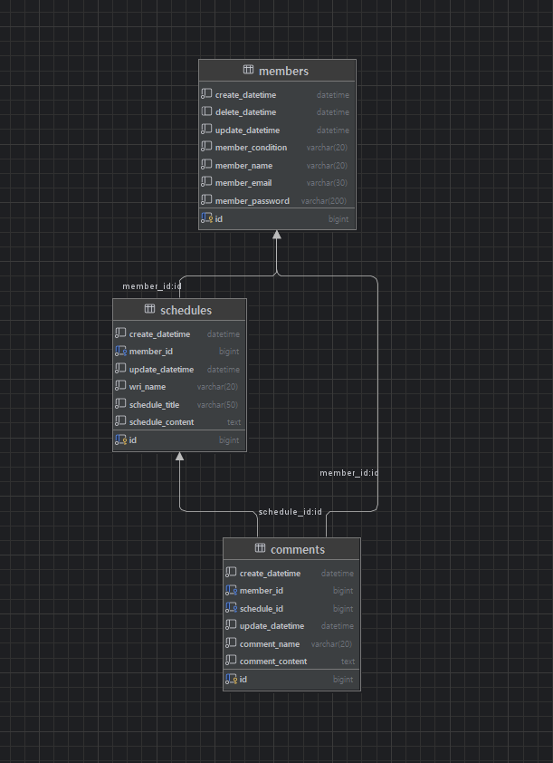

# 📌 Schedule Project

Spring Boot 기반으로 구현한 **일정 관리 + 유저 관리 + 인증/인가 + 댓글 기능** 프로젝트입니다.  
기본 CRUD부터 로그인(Session/Cookie 인증), 비밀번호 암호화(도전), Validation(도전)까지 구현합니다.

---
# 🧾 명세서 ∙ ERD
명세서 : https://www.notion.so/2b0e428d946980b8b8e4eaf2307c0ddd?v=2b0e428d946980dca604000c24387eb5&source=copy_link

ERD : 

---

# 📚 기술 스택

- **Java 17+**
- **Spring Boot**
- **Spring Web / Spring Validation**
- **Spring Data JPA**
- **JPA Auditing**
- **MySQL**
- **Session / Cookie 인증**
- (도전) **BCrypt 암호화 라이브러리**

---

# ✨ 기능 요약

## ✅ Lv 1. 일정 CRUD (필수)

### ✔ 기능
- 일정 **생성(Create)**
- 일정 **조회(Read)**
- 일정 **수정(Update)**
- 일정 **삭제(Delete)**

### ✔ 일정 필드
| 필드명 | 설명 |
|-------|------|
| 작성 유저명 | 문자열 |
| 할일 제목 | 문자열 |
| 할일 내용 | 문자열 |
| 작성일 | JPA Auditing |
| 수정일 | JPA Auditing |

---

## ✅ Lv 2. 유저 CRUD + 연관관계 (필수)

### ✔ 기능
- 유저 생성 / 조회 / 수정 / 삭제

### ✔ 유저 필드
| 필드명 | 설명 |
|-------|------|
| 유저명 | 문자열 |
| 이메일 | 문자열 |
| 작성일 | JPA Auditing |
| 수정일 | JPA Auditing |

### ✔ 연관관계 변경
- 일정은 기존 `작성 유저명`을 제거
- 대신 **유저 고유 식별자(FK)** 를 가짐  
  → **(N : 1) 일정 — 유저**

---

## ✅ Lv 3. 회원가입 (필수)

- 유저에 `비밀번호(password)` 필드 추가
- 비밀번호 저장은 암호화 전 원문 저장 (도전 기능에서 암호화 적용)

---

## ✅ Lv 4. 로그인 기능 (필수)

### ✔ 인증 방식
- **Session/Cookie 기반 로그인 구현**
- 로그인 시 Session 생성 → Cookie로 식별

### ✔ 로그인 조건
- 이메일 + 비밀번호 검증
- 로그인/회원가입 API는 인증 제외(permit)

### ✔ 예외 처리
- 이메일 또는 비밀번호 불일치 → **401 Unauthorized**

---

# 🏆 도전 기능

## 🔥 Lv 5. Validation 예외처리

- 요구사항 예시:
    - 할일 제목은 10글자 이하
    - 유저명은 4글자 이하
- `@Valid`, `@NotBlank`, `@Size` 등 사용
- 발생 예외 → 커스텀 예외로 변환 후 Response DTO로 반환

---

## 🔒 Lv 6. 비밀번호 암호화

### ✔ BCrypt 라이브러리 추가
```gradle
implementation 'at.favre.lib:bcrypt:0.10.2'
